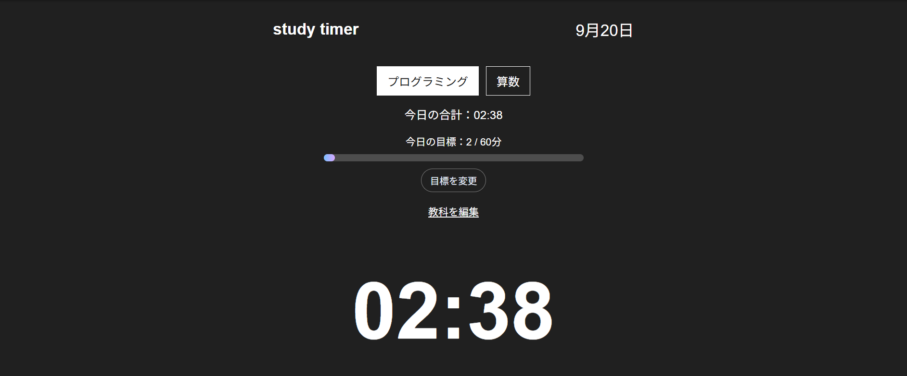

# study timer

勉強時間を教科ごとに記録し、勉強を続けるほど夜空に星座が完成する学習用タイマーです。

## 制作目的

勉強時間をただ記録するだけでなく、継続するほど夜空に星座が完成する仕組みを作りたかったため制作しました。

勉強の進捗を視覚的に確認できることで、毎日の勉強を少し楽しく続けられるアプリを目指しました。

## 主な機能

- スタート／ストップによる経過時間の計測
- リセット機能
- 教科ごとのタイマー切り替え
- 教科名の追加・変更
- ブラウザを更新しても時間を保存
- 日付が変わると時間をリセット
- 合計勉強時間に応じて星座が完成する機能
- 日ごとの勉強履歴を直近7日分表示
- 直近7日間の合計勉強時間を表示
- 今日の目標時間を変更でき、達成状況をバーで確認できる

## 使用技術

- HTML
- CSS
- JavaScript
- localStorage

## 使い方

1. 教科タブを選ぶ
2. スタートを押して勉強を始める
3. 終了したらストップを押す
4. 勉強時間が10分増えるごとに星が1つ増える
5. 星が集まると星座が完成する

## 学んだこと

- HTMLでタイマー画面の構造を作る方法
- CSSで黒背景の画面、教科タブ、星の見た目を整える方法
- JavaScriptでタイマーの開始・停止・リセットを実装する方法
- localStorageで教科ごとの勉強時間を保存する方法
- SVGとJavaScriptで星座を段階的に表示する方法
- 配列の合計処理を使って、直近7日間の勉強時間を計算する方法
- localStorageを使って、ユーザーが設定した目標時間を保存する方法